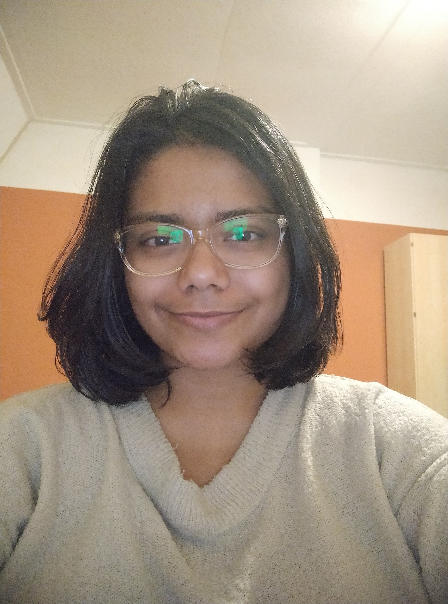

## Ahina Nandy 

<figure>
    
</figure>

I am currently a postdoc at Radboud University, Nijmegen under the supervision of [Magdalena Kędziorek](https://sites.google.com/view/mkedziorek). My research interest lies in motivic, and equivariant stable homotopy theory. I have finished my PhD under careful supervision of [Oliver Röndigs](http://mathematik.uni-osnabrueck.de/roendigs).

In motivic homotopy theory, I am interested in the notion of different orientations of cohomology theories of varieties, and different algebraic cobordisms arising from these notions. I like to try to compute stable homotopy groups of these theories.

Recently I got interested in understanding different levels of equivariant commutativity (aka normed infinity operads) in the rational setting.

Here is my [CV](https://drive.google.com/file/d/1C4sI0T-GbJDAUczOHw2nza_h3yVMUvo0/view?usp=sharing).

### Papers/Preprints
1. An interpolation between special linear and general algebraic cobordism MSL and MGL (submitted). Preprint available at [arXiv:2310.15721](https://arxiv.org/abs/2310.15721).
2. The Motivic Thom Spectrum of Oriented Vector Bundles (in preparation), joint with [Egor Zolotarev](https://www.en.math.lmu.de/personen/mitarbeiter/zolotarev/index.html).
3. Slices of the Special Linear Algebraic Cobordism (in preparation), joint with [Egor Zolotarev](https://www.en.math.lmu.de/personen/mitarbeiter/zolotarev/index.html) and [Oliver Röndigs](http://mathematik.uni-osnabrueck.de/roendigs).
